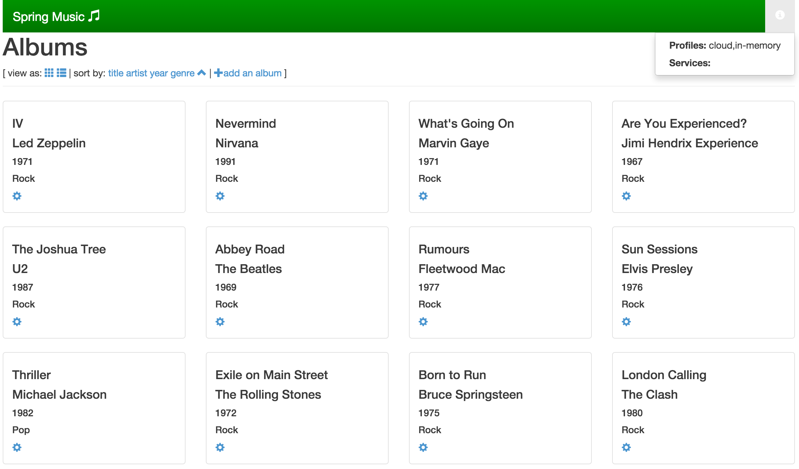

= Lab 5 - From Zero to Pushing Your First Application

== Setup

. If you are on a network that requires a proxy, set the proxy as an environment variable:
+
----
export HTTP_PROXY={HTTP_PROXY}
----

. Set the API target for the CLI:
+
----
$ cf api api.local.pcfdev.io --skip-ssl-validation
----

. Your username/Password will be admin/admin.
. Follow the steps above for login.
. Create your own space and target that space:

. Optional step
----
$ cf create-space <your_username>
$ cf target -s <your_username>
----

== Build and Push!

. Change to the _Spring Music_ sample application directory:
+
----
$ cd $COURSE_HOME/labs/session_02/lab_05/spring-music
----

. If you are on a network that is behind an HTTP proxy, you will need to provide some proxy settings to the Gradle build tool so it can download dependencies. In your user home directory, create a directory named `.gradle` and a file named `gradle.properties` in that directory (e.g. `~/.gradle/gradle.properties` on Linux/OSX or `%USERPROFILE%\.gradle\gradle.properties` on Windows). Add lines like these to that file, with the address and credentials for your HTTP proxy:
+
----
systemProp.http.proxyHost=www.example.com
systemProp.http.proxyPort=8080
systemProp.http.proxyUser=userid
systemProp.http.proxyPassword=password

systemProp.https.proxyHost=www.example.com
systemProp.https.proxyPort=8080
systemProp.https.proxyUser=userid
systemProp.https.proxyPassword=password
----

. Using the Gradle Wrapper, build and package the application:
+
----
$ ./gradlew assemble
----
+
The Gradle Wrapper will automatically download the appropriate version of Gradle for this project along with all of _Spring Music_'s dependencies. This may take a few moments.

. Push the application!
+
----
$ cf push
----
+
You should see output similar to the following listing. Take a look at the listing callouts for a play-by-play of what's happening:
+
====
----
Using manifest file /Users/rjain/Documents/github/pivotalservices/dell/CloudFoundryTraining/labs/session_02/lab_05/spring-music/manifest.yml <1>

Updating app spring-music in org pcfdev-org / space pcfdev-space as admin...
OK <2>

Creating route spring-music-winterweight-expressman.local.pcfdev.io...
OK <3>

Binding spring-music-winterweight-expressman.local.pcfdev.io to spring-music...
OK <4>

Uploading spring-music...
Uploading app files from: /Users/rjain/Documents/github/pivotalservices/dell/CloudFoundryTraining/labs/session_02/lab_05/spring-music/build/libs/spring-music.war
Uploading 569.7K, 90 files
Done uploading
OK <5>

Starting app spring-music in org pcfdev-org / space pcfdev-space as admin... <6>
Downloading go_buildpack...
Downloading ruby_buildpack...
Downloading nodejs_buildpack...
Downloading php_buildpack...
Downloading python_buildpack...
Downloading staticfile_buildpack...
Downloading java_buildpack...
Downloading binary_buildpack...
Downloaded python_buildpack
Downloaded staticfile_buildpack
Downloaded go_buildpack
Downloaded nodejs_buildpack
Downloaded binary_buildpack
Downloaded java_buildpack
Downloaded ruby_buildpack (269.1M)
Downloaded php_buildpack (327.7M)
Creating container
Successfully created container
Downloading app package...
Downloaded app package (20.1M)
Staging...
-----> Java Buildpack Version: v3.5.1 (offline) | http://github.com/pivotal-cf/pcf-java-buildpack.git#d6c19f8
-----> Downloading Open Jdk JRE 1.8.0_65 from https://download.run.pivotal.io/openjdk/trusty/x86_64/openjdk-1.8.0_65.tar.gz (found in cache)
       Expanding Open Jdk JRE to .java-buildpack/open_jdk_jre (1.0s) <7>
-----> Downloading Open JDK Like Memory Calculator 2.0.1_RELEASE from https://download.run.pivotal.io/memory-calculator/trusty/x86_64/memory-calculator-2.0.1_RELEASE.tar.gz (found in cache)
       Memory Settings: -Xss995K -Xms382293K -XX:MetaspaceSize=64M -Xmx382293K -XX:MaxMetaspaceSize=64M
-----> Downloading Spring Auto Reconfiguration 1.10.0_RELEASE from https://download.run.pivotal.io/auto-reconfiguration/auto-reconfiguration-1.10.0_RELEASE.jar (found in cache)
-----> Downloading Tomcat Instance 8.0.30 from https://download.run.pivotal.io/tomcat/tomcat-8.0.30.tar.gz (found in cache) <8>
       Expanding Tomcat Instance to .java-buildpack/tomcat (0.1s)
-----> Downloading Tomcat Lifecycle Support 2.4.0_RELEASE from https://download.run.pivotal.io/tomcat-lifecycle-support/tomcat-lifecycle-support-2.4.0_RELEASE.jar (found in cache)
-----> Downloading Tomcat Logging Support 2.4.0_RELEASE from https://download.run.pivotal.io/tomcat-logging-support/tomcat-logging-support-2.4.0_RELEASE.jar (found in cache)
-----> Downloading Tomcat Access Logging Support 2.4.0_RELEASE from https://download.run.pivotal.io/tomcat-access-logging-support/tomcat-access-logging-support-2.4.0_RELEASE.jar (found in cache)
Exit status 0
Staging complete
Uploading droplet, build artifacts cache...
Uploading droplet...
Uploading build artifacts cache...
Uploaded build artifacts cache (109B)
Uploaded droplet (72.4M) <9>
Uploading complete

0 of 1 instances running, 1 starting
1 of 1 instances running

App started

OK

App spring-music was started using this command `CALCULATED_MEMORY=$($PWD/.java-buildpack/open_jdk_jre/bin/java-buildpack-memory-calculator-2.0.1_RELEASE -memorySizes=metaspace:64m.. -memoryWeights=heap:75,metaspace:10,native:10,stack:5 -memoryInitials=heap:100%,metaspace:100% -totMemory=$MEMORY_LIMIT) &&  JAVA_HOME=$PWD/.java-buildpack/open_jdk_jre JAVA_OPTS="-Djava.io.tmpdir=$TMPDIR -XX:OnOutOfMemoryError=$PWD/.java-buildpack/open_jdk_jre/bin/killjava.sh $CALCULATED_MEMORY -Daccess.logging.enabled=false -Dhttp.port=$PORT" exec $PWD/.java-buildpack/tomcat/bin/catalina.sh run` <10>

Showing health and status for app spring-music in org pcfdev-org / space pcfdev-space as admin... <11>
OK

requested state: started
instances: 1/1
usage: 512M x 1 instances
urls: spring-music-unbrailed-centiliter.local.pcfdev.io, spring-music-winterweight-expressman.local.pcfdev.io
last uploaded: Mon Mar 21 00:21:25 UTC 2016
stack: cflinuxfs2
buildpack: java-buildpack=v3.5.1-offline-http://github.com/pivotal-cf/pcf-java-buildpack.git#d6c19f8 open-jdk-like-jre=1.8.0_65 open-jdk-like-memory-calculator=2.0.1_RELEASE spring-auto-reconfiguration=1.10.0_RELEASE tomcat-access-logging-support=2.4.0_RELEASE to...

     state     since                    cpu    memory         disk           details
#0   running   2016-03-21 05:52:14 AM   0.0%   692K of 512M   101.2M of 1G
----
<1> The CLI is using a manifest to provide necessary configuration details such as application name, memory to be allocated, and path to the application artifact.
Take a look at `manifest.yml` to see how.
<2> In most cases, the CLI indicates each Cloud Foundry API call as it happens.
In this case, the CLI has created an application record for _Spring Music_ in your assigned space.
<3> All HTTP/HTTPS requests to applications will flow through Cloud Foundry's front-end router called http://docs.cloudfoundry.org/concepts/architecture/router.html[(Go)Router].
Here the CLI is creating a route with random word tokens inserted (again, see `manifest.yml` for a hint!) to prevent route collisions across the default `cfapps.io` domain.
<4> Now the CLI is _binding_ the created route to the application.
Routes can actually be bound to multiple applications to support techniques such as http://www.mattstine.com/2013/07/10/blue-green-deployments-on-cloudfoundry[blue-green deployments].
<5> The CLI finally uploads the application bits to PCFDev. Notice that it's uploading _90 files_! This is because Cloud Foundry actually explodes a ZIP artifact before uploading it for caching purposes.
<6> Now we begin the staging process. The https://github.com/cloudfoundry/java-buildpack[Java Buildpack] is responsible for assembling the runtime components necessary to run the application.
<7> Here we see the version of the JRE that has been chosen and installed.
<8> And here we see the version of Tomcat that has been chosen and installed.
<9> The complete package of your application and all of its necessary runtime components is called a _droplet_.
Here the droplet is being uploaded to PWS's internal blobstore so that it can be easily copied to one or more _http://docs.cloudfoundry.org/concepts/architecture/execution-agent.html[Droplet Execution Agents (DEA's)]_ for execution.
<10> The CLI tells you exactly what command and argument set was used to start your application.
<11> Finally the CLI reports the current status of your application's health.
You can get the same output at any time by typing `cf app spring-music`.
====

. Visit the application in your browser by hitting the route that was generated by the CLI:
+

+
Be sure to click on the ``information icon'' in the top right-hand corner of the UI.
This gives you important information about the state of the currently running _Spring Music_ instance, including what Spring Profiles are turned on and what Cloud Foundry services are bound.
It will become important in the next lab!
